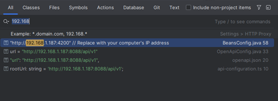

# Live Companion Website Detailing Features and Functionalities. 
### WEBSITE URL
## Steps to Installing and Running the Project
### Requirements: 
###### Java v17+, PostgresSql, NPM package manager, Docker Compose
# Setting up the Backend
1. Clone the repository:
    ```bash
    git clone https://github.com/MR-VL/Puzzlez.git
    ```
2. Set up a PostgresSql database named
    ```markdown
        puzzle_network
   ```
   
3. Run the docker-compose file:
    ```bash
    docker-compose build
    docker-compose up
    ```

4. Navigate to the puzzle network directory:
    ```bash
    cd puzzle-network-api
    ```

5. Install dependencies (If Maven is installed globally):
    1. Assuming Maven is installed globally on the computer:
        ```bash
        mvn clean install
        ```

    2. Install dependencies (Using IntelliJ IDEA):
        ```markdown
        Right-click on the pom.xml file
        Maven
        Add as Maven project
        ```
    3. For other compilers, Please refer to their documentation about importing and setting up a Springboot project <br><br>
6. Run the application (If errors occur, see step 7).<br><br>

7. Manually set project structure:
    ```markdown
    Right-click on src/main/java and select Mark Directory as > Sources Root.
    Right-click on src/main/resources and select Mark Directory as > Resources Root.
    Right-click on src/test/java and select Mark Directory as > Test Sources Root.
    Right-click on src/test/resources and select Mark Directory as > Test Resources Root.
    ```

8. Reload Maven project:
    ```markdown
    Right-click on the pom.xml file
    Maven
    Reload project
    ```
9. Run the application.

### The Backend of the project should now be running successfully

# Setting up the Frontend
This requires npm to be installed.
#### Install NPM
If you do not have npm currently installed please go to the npm website and read how to install npm for your operating system
    ```
    https://docs.npmjs.com/downloading-and-installing-node-js-and-npm
    ```
### After installing NPM

1. Navigate to the Frontend directory
    ```bash 
    cd Frontend
   ```
   
2. Run the Npm install command
    ```bash
   npm install
   ```
3. In your IDE search project type 
    ```markdown
   192.168.
   ```
   There should be 4 results that populate
    

    #### Replace the 192.168.187 to your computers Lan adaptor's IP address that you wish to use.
    You can find this by using IpConfig
    ```bash
    ipconfig
   ```
4. Run the frontend 
    ```bash
   ng serve
   ```
    #### You will most likely only have to repeat this process once for the initial setup. The Frontend is designed to automatically start using the docker compose up cmd.
    ### Warning: 
    
    Starting the project using docker, it does not support hot reload functionality, if you are in the development process, you will manually have to refresh the page.

  